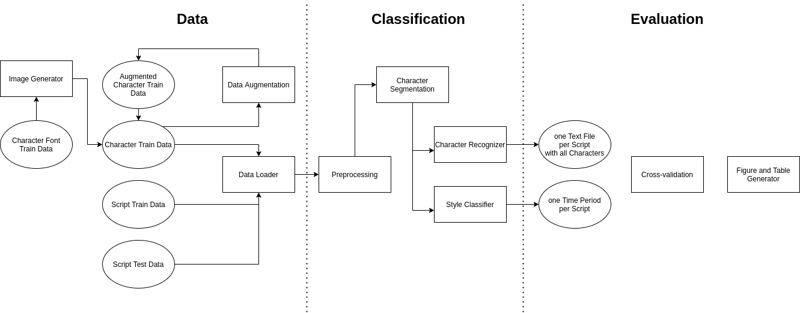

# Architecture

## Outline

- training data generation, augmentation and loading

	- pre-training on fonts
		
		- e.G. habbakuk font and python script <https://unishare.nl/index.php/s/wHGFLPNGBEc8Gta>
	
	- augmenting data
		
		- e.G. <https://github.com/GrHound/imagemorph.c>

	- loading data
		
		- loading training character data
		- loading training/testing fragment data

- training/testing pipeline
	
	- preprocessing
	
		- use binarized character data
		- use binarized fragment data
		- n-gram-ify character
	
	- encoding/vectorization of characters
	
		- build n-gram vocabulary using ngram_frequencies.xlsx
		- encode n-grams as vectors
	
	- character segmentation
	
		- line bounding box
		- character bounding box
		- approach: center of gravity
	
	- character recognition
	
		- ngrams
        - CNN
	
	- style/period classification

	- write output

		- character recognition: text file with recognized characters for each input image
		- style classification: class for each input image

- evaluation pipeline
    
    - loading the output of the training/testing pipeline

	- cross-validation

	- figures for analysis

		- bias
		- variance
		- accuracy
		- error
		- loss